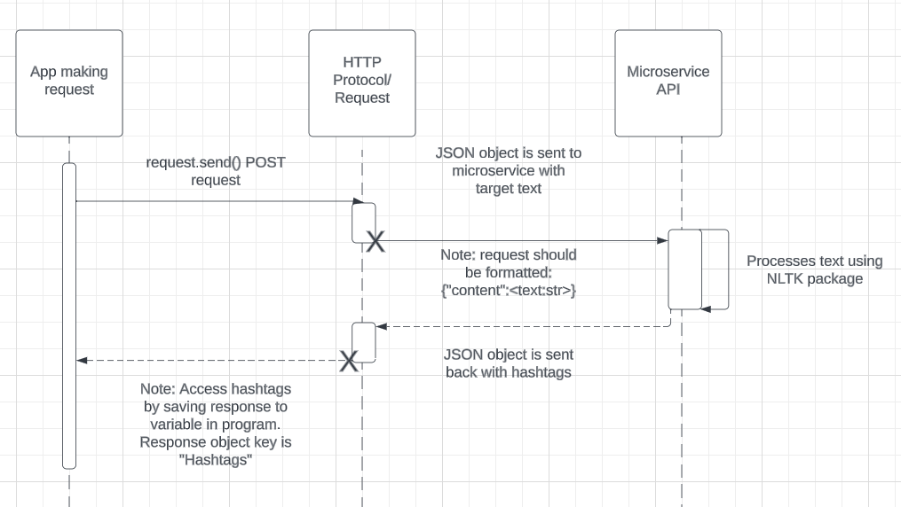

# 361-microservice

Microservice for partner's project for CS 361:
I am implementing a microservice that communicates with HTTP Requests (RESTful API). It will retrieve user-submitted text and analyze the text by using natural language processing techniques such as RAKE to find the keywords which will be used in Brooke's hashtag generator website. It will then provide several hashtags in response.

To use my API microservice:

1. Stringify your target text. My microservice is hosted, so if you are using Python, use the request package and send POST to my microservice using request.post().
2. Send a POST request to my API (hosted at https://cs-361-microservice-405500.wl.r.appspot.com/hashtaggenerator). The POST request's body should be of the form: {"content": "[Target text in string format]"}.
3. The API will send back 5 hashtags of the most commonly occurring nouns in the text.

UML diagram:

